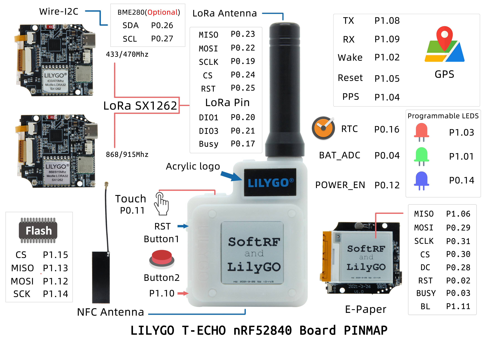
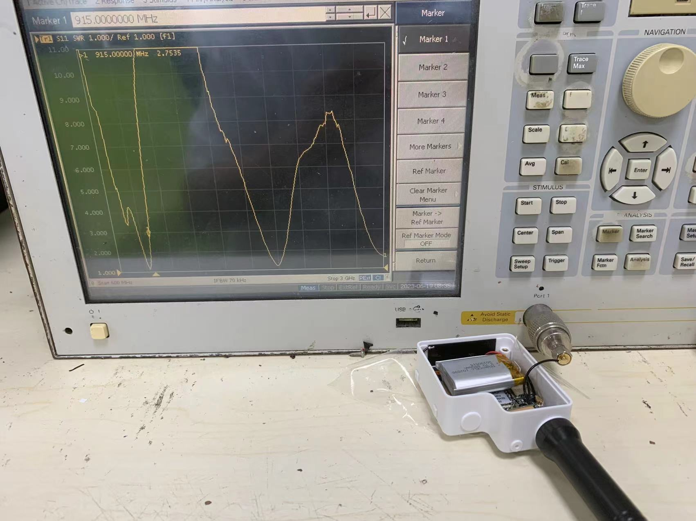
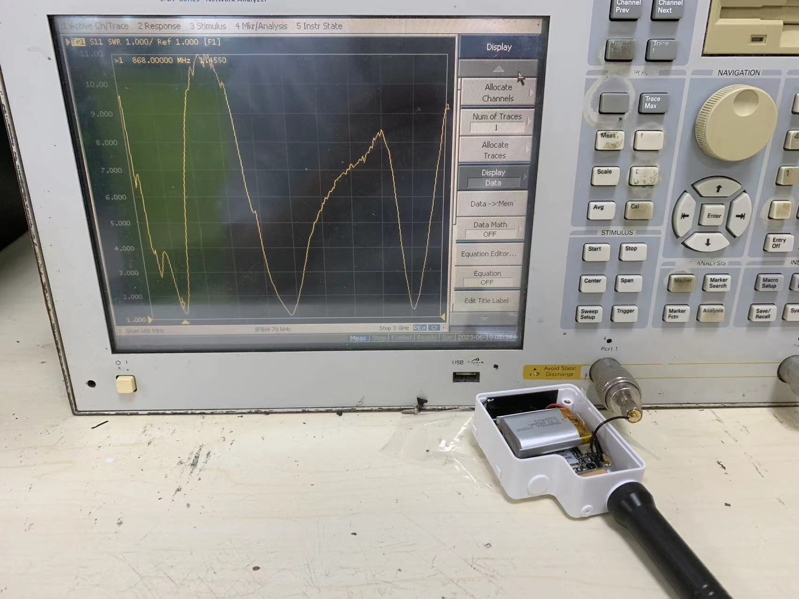
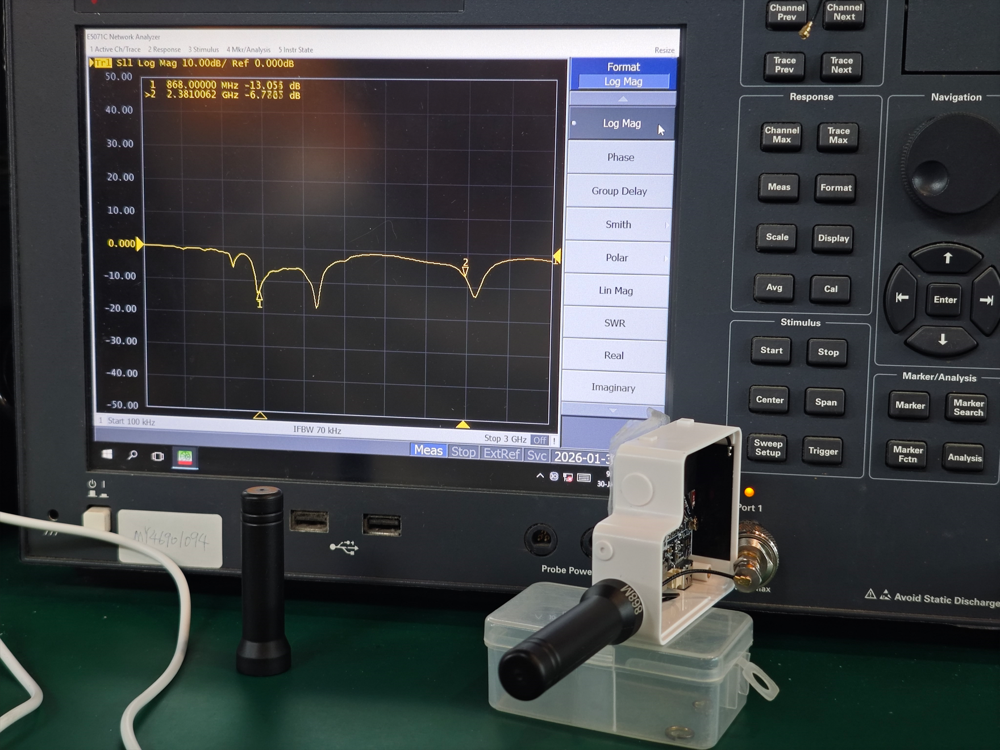
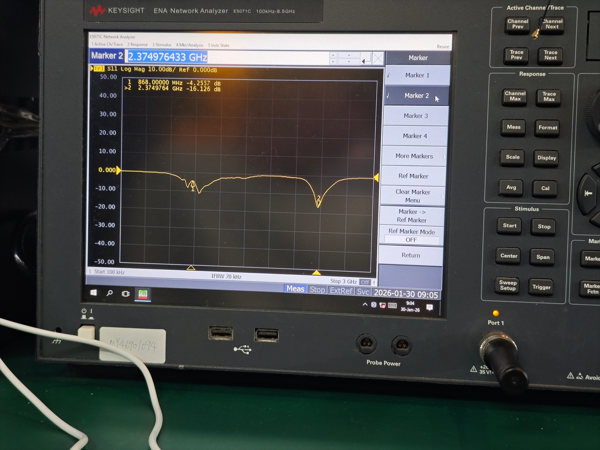
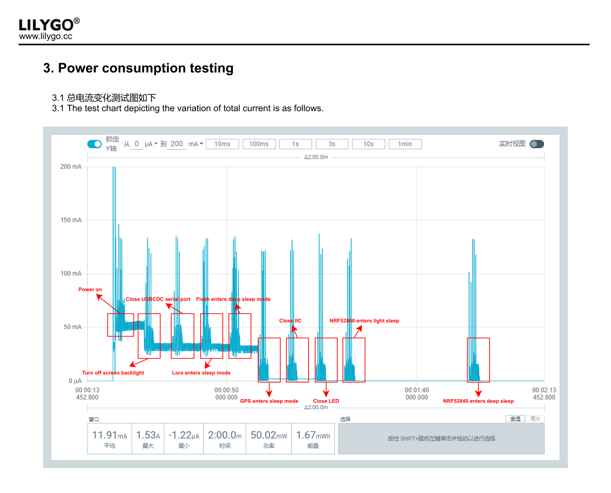

  

<h1 align = "center">🌟 LilyGo T-Echo-MicroPython 🌟</h1>

## 📖 Table of Contents

- [📖 Table of Contents](#-table-of-contents)
- [📋 Product](#-product)
- [🚀 Quick Start](#-quick-start)
  - [Arduino IDE Quick Start](#arduino-ide-quick-start)
  - [PlatformIO Quick Start](#platformio-quick-start)
- [📷 Product](#-product-1)
- [💾 Flash Factory Firmware](#-flash-factory-firmware)
- [🔧 Hardware Description](#-hardware-description)
  - [T-echo pinout](#t-echo-pinout)
  - [T-echo Plus Back panel](#t-echo-plus-back-panel)
  - [✨ Display Features](#-display-features)
  - [🧑🏼‍🔧 I2C Devices Address](#-i2c-devices-address)
  - [⚡ Electrical Parameters](#-electrical-parameters)
  - [💡 LED](#-led)
    - [Charger LED Status](#charger-led-status)
  - [⏺︎ Button](#︎-button)
- [📡 Antenna Actual Test Reference](#-antenna-actual-test-reference)
- [📄 Datasheet](#-datasheet)
- [📐 Case \& Dimensions](#-case--dimensions)
- [📱 Application](#-application)
- [⚠️ Precautions](#️-precautions)
- [🔋 Battery Life](#-battery-life)
- [📝 Announcements](#-announcements)

---

## 📋 Product

|     Product      |                          Difference                           |
| :--------------: | :-----------------------------------------------------------: |
|   [T-Echo][1]    |                   Battery Capacity  850mAh                    |
| [T-Echo Plus][7] | Battery Capacity 2400mAh + BHI260 Smart IMU + Haptic + Buzzer |

[1]: https://lilygo.cc/products/t-echo-lilygo
[7]: https://lilygo.cc/products/t-echo-plus

---

## 🚀 Quick Start

### 1.Thonny IDE

1. Install [Thonny IDE]([Thonny, Python IDE for beginners](https://thonny.org/)) 

2. Download version 4.1.7 or the latest version (Choose Linux or macOS or Windows)

   

3. After installing the installation package, open Thonny IDE

4. Click Configure interpreter

   

5. Select MicroPython (ESP32)

   

6. Select the corresponding port number and confirm

   

7. Test run the program (Print "hello world" below is OK. You can use the shortcut key F5 to run the program and ctrl+F2 to end it)

   `print("hello world")`

   

8. If you want to run the program automatically, please click Save, then select MicroPython device and name it main.py

   

   

9. After successful saving, reset the T-Pico-2350.

### 2.Arduino lab for micropython IDE

1. Install [Arduino lab for micropython IDE](https://labs.arduino.cc/en/labs/micropython).

2. Install **Desktop Version (Choose Linux or macOS or Windows)**

3. Open the folder and open "Arduino Lab for MicroPython.exe".

   

4. Connect the serial port.

   

5. Click Run the program (If you want to Stop the program, please click Stop).

   

6. If you want to run the program automatically, please click file and then create a new code named "main.py". Select  "Board" Then write the code into main.py and save it. Reset the T-LoRa-Pager.

   

### 3.RT-Thread MicroPython

1. Install [Python](https://www.python.org/downloads/) (according to you to download the corresponding operating system version, suggest to download version 3.7 or later), MicroPython requirement 3. X version, if you have already installed, you can skip this step).
2. Install [Visual Studio Code](https://code.visualstudio.com/Download), Choose installation based on your system type.
3. Open the "Extension" section of the Visual Studio Code software sidebar(Alternatively, use "<kbd>Ctrl</kbd>+<kbd>Shift</kbd>+<kbd>X</kbd>" to open the extension),Search for the "RT-Thread MicroPython" extension and download it.
4. During the installation of the extension, you can go to GitHub to download the program. You can download the main branch by clicking on the "<> Code" with green text, or you can download the program versions from the "Releases" section in the sidebar.
5. After the installation of the extension is completed, open the Explorer in the sidebar(Alternatively, use "<kbd>Ctrl</kbd>+<kbd>Shift</kbd>+<kbd>E</kbd>" go open it),Click on "Open Folder," locate the project code you just downloaded (the entire folder), and click "Add." At this point, the project files will be added to your workspace.
6. Click on "<kbd>[Device Connected/Disconnected](./image/vscode1.png)</kbd>" at the lower left corner, and then click on the pop-up window "<kbd>[COMX](./image/vscode2.png)</kbd>" at the top to connect the serial port. A pop-up pops up at the lower right corner saying "<kbd>[Connection successful](./image/vscode3.png)</kbd>" and the connection is complete.
7. After opening the code, click on“<kbd>[▶](./image/vscode4.png)</kbd>”at the lower left corner to run the program“<kbd>[Run this MicroPython file directly on the device](./image/vscode5.png)</kbd>”，Or use the<kbd>Alt</kbd>+<kbd>Q</kbd>），if you want to stop the program, click on the lower left corner of the“<kbd>[⏹](./image/vscode6.png.png)</kbd>”stop running the program.**(If you need to run the program automatically on the board, please copy the code to the "[main.py](../examples/main.py)" file under the "exampels" folder and save it. Select the "main.py" file with the left mouse button. Right-click the mouse and select "[Download this file/folder to device](./image/vscode7.png)", then press the reset button on the board to run the program automatically.)**

---

## 📷 Product

> **Note:** Please see the list below for the complete pinout.

---

## 💾 Flash Factory Firmware

If you need to restore the factory firmware or flash the UnitTest firmware for hardware testing, please refer to the [Firmware Flashing Guide](./firmware/README.MD).

## 🔧 Hardware Description

### T-echo pinout

| Name                 | Chip pin number | Arduino pin number | Note                                              |
| -------------------- | --------------- | ------------------ | ------------------------------------------------- |
| Display              | Display         | Display            | Display                                           |
| Display MOSI         | P1.6            | 36                 |                                                   |
| Display MISO         | P0.29           | 29                 |                                                   |
| Display SCLK         | P0.31           | 31                 |                                                   |
| Display BUSY         | P0.3            | 3                  |                                                   |
| Display DC           | P0.28           | 28                 |                                                   |
| Display CS           | P0.30           | 30                 |                                                   |
| Display RST          | P0.2            | 2                  |                                                   |
| Display backlight    | P1.11           | 43                 |                                                   |
| LoRa                 | LoRa            | LoRa               | LoRa                                              |
| LoRa MOSI            | P0.22           | 22                 |                                                   |
| LoRa MISO            | P0.23           | 23                 |                                                   |
| LoRa SCLK            | P0.19           | 19                 |                                                   |
| LoRa BUSY            | P0.17           | 17                 |                                                   |
| LoRa CS              | P0.24           | 24                 |                                                   |
| LoRa RST             | P0.25           | 25                 |                                                   |
| LoRa DIO0            | P0.22           | 22                 |                                                   |
| LoRa DIO1            | P0.20           | 20                 |                                                   |
| LoRa DIO3            | P0.21           | 21                 |                                                   |
| GPS                  | GPS             | GPS                | GPS                                               |
| [GPS L76K][8] TX     | P1.8            | 40                 |                                                   |
| [GPS L76K][8] RX     | P1.9            | 41                 |                                                   |
| [GPS L76K][8] PPS    | P1.4            | 36                 |                                                   |
| [GPS L76K][8] Wakeup | P1.2            | 34                 |                                                   |
| [GPS L76K][8] RESET  | P1.5            | 37                 |                                                   |
| LED                  | LED             | LED                | LED                                               |
| Red LED              | P1.3            | 35                 |                                                   |
| Blue LED             | P0.14           | 14                 |                                                   |
| Green LED            | P1.1            | 33                 |                                                   |
| BUTTON               | BUTTON          | BUTTON             | BUTTON                                            |
| RESET                | P0.18           | 18                 | Reset device, cannot be used for other functions. |
| User Button          | P1.10           | 42                 | Low level active                                  |
| FLASH                | FLASH           | FLASH              | FLASH                                             |
| QSPI SCLK            | P1.14           | 46                 | SPI SCK                                           |
| QSPI CS              | P1.15           | 47                 | SPI CS                                            |
| QSPI IO0             | P1.12           | 44                 | SPI MOSI                                          |
| QSPI IO1             | P1.13           | 45                 | SPI MISO                                          |
| QSPI IO2             | P0.7            | 7                  | SPI NC                                            |
| QSPI IO3             | P0.5            | 5                  | SPI NC                                            |
| Touch Button         | P0.11           | 11                 | High level active                                 |
| Battery ADC          | P0.4            | 4                  |                                                   |
| RTC                  | RTC             | RTC                | RTC                                               |
| PCF8563 SDA          | P0.26           | 26                 | Share I2C Bus                                     |
| PCF8563 SCL          | P0.27           | 27                 | Share I2C Bus                                     |
| PCF8563 IRQ          | P0.16           | 16                 |                                                   |
| SENSOR               | SENSOR          | SENSOR             | SENSOR                                            |
| BEM280 SDA           | P0.26           | 26                 | Share I2C Bus                                     |
| BEM280 SCL           | P0.27           | 27                 | Share I2C Bus                                     |

> **Note:** t-echo and t-echo plus use the same pinout.

### T-echo Plus Back panel

| Name           | Chip pin number | Arduino pin number | Note          |
| -------------- | --------------- | ------------------ | ------------- |
| Drv2605 Enable | P0.08           | 8                  |               |
| Drv2605 SDA    | P0.26           | 26                 |               |
| Drv2605 SCL    | P0.27           | 27                 |               |
| Buzzer         | P0.06           | 6                  |               |
| BHI260 SDA     | P0.26           | 26                 | Share I2C Bus |
| BHI260 SCL     | P0.27           | 27                 | Share I2C Bus |
| BHI260 IRQ     | NC              | NC                 |               |

---

### ✨ Display Features

| Feature               | Value            |
| --------------------- | ---------------- |
| Model                 | [GDEH0154D67][2] |
| Resolution            | 200x200          |
| Display Size          | 1.54 Inch        |
| Driver IC             | SSD1681 (SPI)    |
| Pixel Pitch           | 0.135 × 0.135 mm |
| Refresh Time          | 2 s              |
| Partial Refresh Time  | 0.26 s           |
| Display Type          | Dot Matrix       |
| Max Grayscale         | 2                |
| Colors                | Black, White     |
| Operating Temperature | 0°C ~ 50°C       |

[2]: https://www.e-paper-display.com/products_detail/productId=455.html

### 🧑🏼‍🔧 I2C Devices Address

| Device       | 7-Bit Address | Shared Bus |
| ------------ | ------------- | ---------- |
| [BME280][3]  | 0x77          | ✅          |
| [DRV2605][4] | 0x5A          | ✅          |
| [BHI260][5]  | 0x28          | ✅          |
| [PCF8563][6] | 0x51          | ✅          |

[3]: https://www.bosch-sensortec.com/media/boschsensortec/downloads/datasheets/bst-bme280-ds002.pdf
[4]: https://www.ti.com/lit/ds/symlink/drv2605.pdf
[5]: https://www.bosch-sensortec.com/media/boschsensortec/downloads/datasheets/bst-bhi260ab-ds000.pdf
[6]: https://www.nxp.com/docs/en/data-sheet/PCF8563.pdf
[8]: https://www.quectel.com.cn/product/gnss-l76k

### ⚡ Electrical Parameters

| Feature             | Details        |
| ------------------- | -------------- |
| USB-C Input Voltage | 4.8V - 5.5V    |
| Charge Current      | 500mA (Fixed)  |
| Battery Voltage     | 3.7V           |
| Battery Capacity    | 850mAh/2400mA  |
| Battery Connector   | [MX 1.25mm][6] |
| Charge Temperature  | 0°C ~ 60°C     |

[6]: https://dghonshi.com/productinfo/1152005.html

> [!IMPORTANT]
>
> When the USB port is plugged in, the battery will start charging. During this time, the battery voltage data obtained by the ADC will be inaccurate. When the voltage obtained by the ADC is greater than 4200mV, it can be determined that the USB port is connected. Please check the charging status indicator light for the charging status.
>
> Note: A USB-A to USB-C cable is required for power supply. If a USB-C to USB-C cable is used to power the t-echo, the power supply may refuse to provide power to the device.
>

### 💡 LED

| LED       | Location                                    | Note                     |
| --------- | ------------------------------------------- | ------------------------ |
| Red LED   | First LED from the right (middle position)  | Charger status indicator |
| Red LED   | Second LED from the right (middle position) | Tricolor LED             |
| Blue LED  | Second LED from the right (middle position) | Tricolor LED             |
| Green LED | Second LED from the right (middle position) | Tricolor LED             |

#### Charger LED Status

| Status         | Note                            |
| -------------- | ------------------------------- |
| Constantly lit | Charging                        |
| Blinking       | Battery not connected or faulty |
| Off            | Fully charged                   |

### ⏺︎ Button

| Button      | GPIO           | Note                           |
| ----------- | -------------- | ------------------------------ |
| RESET       | P0.18 (GPIO18) | Reset device or enter DFU mode |
| User Button | P1.10 (GPIO42) | User button, active low        |

- Double-click the top-left button to enter DFU mode.
- Single-click the top-left button to reset the device.

## 📡 Antenna Actual Test Reference

The following test results show the antenna performance:

    
    

* The left image shows 868MHz, and the right image shows 915MHz.

> [!IMPORTANT]
> The antenna on the T-Echo is tuned to its optimal parameters based on the overall device setup. The image below compares the network analyzer results with the antenna installed separately and with the antenna installed on the main unit. It shows that the antenna's performance is not ideal when tested alone, but becomes much better when installed on the main unit.

    
    

* The left image shows the entire device, and the right image shows a single antenna.

---

## 📄 Datasheet

- [T-echo and plus](./schematic/T-Echo_Schematic.pdf)
- [T-echo a7682](./schematic/T-ECHO-A7682.pdf)
- [T-BHI260 V1.0](./schematic/T-BHI260.pdf)
- [T-BHI260 V1.1](./schematic/T-BHI260_V1.1.pdf)
- [T-BHI260](./schematic/T-BHI260_V1.1.pdf)
- [T-ICM29048](./schematic/T-ICM29048.pdf)
- [T-ECHO-BEEP](./schematic/T-ECHO-BEEP%20V1.0%2025-07-31.pdf)
- [T-ECHO-CON](./schematic/T-ECHO-CON%20V1.0%2025-02-20.pdf)

## 📐 Case & Dimensions

- [T-BHI260-ICM29048 DXF](./dimensions/T-BHI260-ICM29048.dxf)
- [T-echo 3d](./dimensions/t-echo_3d.stl)
- [T-echo-plus BackCover](./dimensions/t-echo-plus-back-cover.7z)
- [T-BHI260.kicad_mod](https://github.com/Xinyuan-LilyGO/T-Display-S3-Pro/blob/master/schematic/kicad_sensor.pretty/T-BHI260.kicad_mod)
- [T-CIM29048.kicad_mod](https://github.com/Xinyuan-LilyGO/T-Display-S3-Pro/blob/master/schematic/kicad_sensor.pretty/T-CIM29048.kicad_mod)

## 📱 Application

- [T-Echo SoftRF](https://github.com/lyusupov/SoftRF/wiki/Badge-Edition)
- [T-Echo Meshtastic](https://github.com/meshtastic/Meshtastic-device/releases)

---

## 🔋 Battery Life

Current consumption from 3.7V battery:

|         Mode         | Average current |
| :------------------: | :-------------: |
| Active backlight OFF |      42 mA      |
| Active backlight ON  |      55 mA      |
|        Sleep         |     0.25 mA     |

> **Note:** Operating time from a full charge depends on your actual battery capacity.

The figure below represents a more specific test. You can use the example [Sleep_Display](./examples/Sleep_Display) to write your low-power device program.

    

